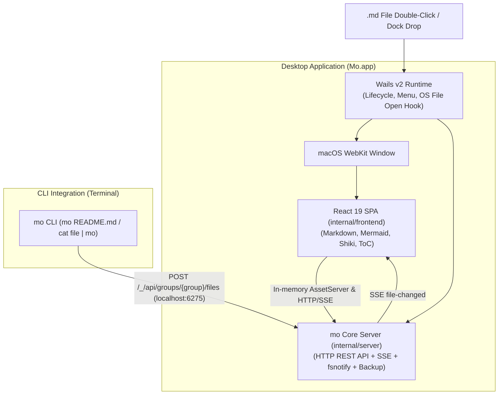

# mo Desktop Application (macOS)

`mo` can be run and packaged as a native macOS desktop application (`Mo.app`) powered by [Wails v2](https://wails.io/).

It provides the full feature set of `mo` (GitHub-flavored Markdown, Mermaid diagrams, KaTeX math, Shiki syntax highlighting, live-reload, file grouping, table of contents) inside a dedicated, lightweight native window.

---

## Key Features

- **Native macOS Experience**: Runs in a dedicated WebKit WebView without browser tab or URL bar clutter.
- **File Association**: Registered as a default viewer for `.md`, `.markdown`, and `.mdx` files. Double-clicking a Markdown file in Finder opens it directly in `mo`.
- **Keyboard Shortcuts & Native Menu Bar**:
  - `Cmd+O`: Open Markdown File dialog
  - `Cmd+Shift+O`: Open Directory dialog
  - `Cmd+R`: Reload window
  - `Cmd+W`: Close window
  - `Cmd+0`: Reset window to default size
  - `Ctrl+Cmd+F`: Toggle full screen
- **CLI & GUI Hybrid Synchronization**:
  - When `Mo.app` is open, running `mo <file>` from any terminal automatically sends the file to the active desktop window via the local server (`localhost:6275`) using Server-Sent Events (SSE).
- **Lightweight & Fast**: Uses native macOS WebKit (no heavy Chromium bundle), keeping binary size small (~20MB) and memory usage low.

---

## Installation & Build

### Prerequisites

- **Go**: 1.26 or higher
- **pnpm**: for building the frontend
- **Wails CLI**:
  ```bash
  go install github.com/wailsapp/wails/v2/cmd/wails@latest
  ```

### Building the Desktop App

To compile the React frontend and produce the macOS `.app` bundle:

```bash
make desktop
```

The output will be created at:
```text
build/bin/Mo.app
```

---

## Usage

### 1. Launching the App

- **From Finder / Dock**: Double-click `build/bin/Mo.app` or open via Spotlight.
- **From Terminal**:
  ```bash
  open build/bin/Mo.app
  ```
- **Via CLI command**:
  ```bash
  mo gui README.md
  # or
  mo --gui docs/*.md
  ```

### 2. Opening Files from Terminal into the Desktop Window

If `Mo.app` is already running:
```bash
mo spec.md                  # Adds spec.md to the active desktop window
mo notes.md --target notes  # Opens notes.md in a separate "notes" tab group
```

---

## Architecture



---

## CI / Automated Release

A GitHub Actions workflow (`.github/workflows/desktop-release.yml`) is available to build macOS desktop artifacts (`.zip` for Apple Silicon `arm64` and Intel `amd64`) upon publishing a tag (`v*`).
